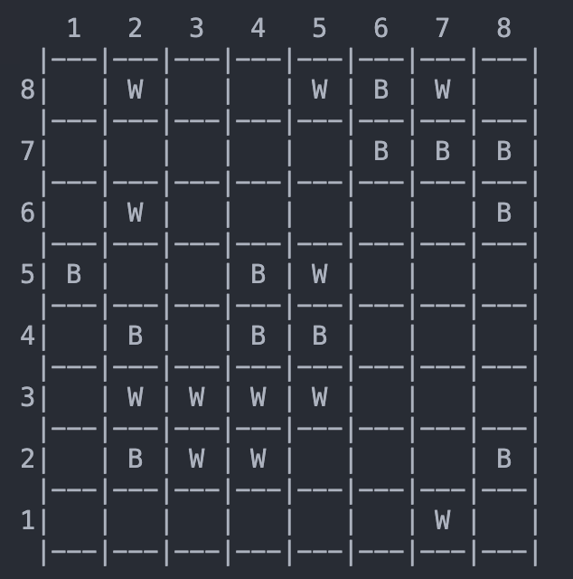

# Mabula

Made by:
- Vanessa Sophie Barros Queirós (up202207919) 
    - 50% of contributions. Developed half of the game.

- António Abílio Parada Santos (up202205469)
    - 50% of contributions. Developed half of the game.

## Installation

In order to play Mabula you will need to have SICStus Prolog.

To execute on Linux, Windows or macOS do the following:

1. Copy **game.pl** file's path.
2. Inside the SICStus Prolog terminal window run the command ```consult('<game.pl file path>').```.
3. To start the game, run ```play.``` in SICStus Prolog's terminal window.

## Description

The Mabula board game (computer version) is a game for 2 players.

The main objective of the game is to connect as many of a player's marbles as possible.

Initially, 24 marbles (12 black marbles and 12 white marbles) are placed randomly along the perimeter of the board. Marbles cannot occupy the corner spaces, and no more than two marbles of the same color may be placed next to each other, even if the sequence wraps around a corner.

Each player takes turns moving a marble of their color from the perimeter. A marble can be pushed as far as desired and may push other marbles along with it, provided the move is valid. Once a marble has left the perimeter, it cannot be pushed back onto it. The game ends when neither player has any valid moves remaining. The winner is the player whose marbles form the largest contiguous group of the same color.

A good video explanation is provided [here](https://www.youtube.com/watch?v=FCLpHHBHZRI&t=1s).

A good rule book is provided by **Steffen Spiele** and is located [here](https://steffen-spiele.com/products/mabula).

## Considerations for Game Extensions

Our game supports dynamic board sizes, offering flexibility for players. The board can range from a minimum size of 3×3 to a maximum of 20×20. While technically the game does not impose a hard limit, we have optimized performance for boards up to 20×20 to ensure a smooth gaming experience.

## Game Logic
 
### Game Configuration Representation

When we first call ``play`` our game starts by calling ``configure_game`` which, depending on the mode chosen by the player, will create a **GameConfig** which has the following values:

- **L1**: Level for Player 1;
- **L2**: Level for Player 2;
- **P1**: Name of Player 1;
- **P2**: Name of Player 2.

The variables **L1** and **L2** can have the following values:

- **0** if the corresponding Player is a Human.

- **1** if the corresponding Player is a Level 1 Bot (Chooses a valid move randomly).

- **2** if the corresponding Player is a Level 2 Bot (Uses a greedy algorithm to choose a valid move).

After returning from ``configure_game``, we call the ``initial_state/2`` predicate which is used to prepare the call to ``game_cycle``. This predicate receives the previously created **GameConfig** and, after creating a **board** by calling the ``construct_board/1`` predicate, it returns a **GameState** (initially, **Board-L1-L2-P1-P2-P1-0-L1**).

**GameState** now contains 4 new variables:

- **Board**:
    - This is the actual Mabula Board. It is a Matrix that has size N*N and in the beginning has marbles only at the perimeter (We decided that black marbles woule be represented by a 0 and white marbles by a 1) and null values in every other place.
    - The Matrix has N lists where the first and last ones represent the top and the bottom of the Board and the beginning and end of every other list (middle section) are the representation of the left and right side.
    - To help visualize this variable we provide a couple of examples:
    
### Board Examples

#### Beginning
If the beginning the **Board** variable may hold a list of lists (matrix) that looks something like this:

```prolog
[[null,  1  ,  1  ,  0  ,  1  ,  0  ,  1  , null],
[  0  , null, null, null, null, null, null,  0  ],
[  1  , null, null, null, null, null, null,  0  ],
[  0  , null, null, null, null, null, null,  1  ],
[  0  , null, null, null, null, null, null,  0  ],
[  1  , null, null, null, null, null, null,  1  ],
[  0  , null, null, null, null, null, null,  0  ],
[ null,  1  ,  1  ,  0  ,  1  ,  0  ,  1  , null]]
```

and looks something like this when we use the ``display_game/2`` predicate:

<div style="text-align: center;">
    
</div>

#### Middle

In the middle of the game the **Board** variable may look something like:

```prolog
[[null,  1  , null, null,  1  ,  0  ,  1  , null],
[ null, null, null, null, null,  0  ,  0  ,  0  ],
[ null,  1  , null, null, null, null, null,  0  ],
[  0  , null, null,  0  ,  1  , null, null, null],
[ null,  0  , null,  0  ,  0  , null, null, null],
[ null,  1  ,  1  ,  1  ,  1  , null, null, null],
[ null,  0  ,  1  ,  1  , null, null, null,  0  ],
[ null, null, null, null, null, null,  1  , null]]
```

and looks something like this when we use the ``display_game/2`` predicate:

<div style="text-align: center;">
    
</div>

#### End

In the end of the game the **Board** variable may look like:

```prolog
[[null, null, null, null, null, null, null, null],
[ null,  1  , null,  0  , null, null, null, null],
[ null,  1  , null,  0  , null, null, null, null],
[ null, null, null,  0  ,  1  , null, null, null],
[ null,  0  , null,  0  ,  0  ,  0  ,  1  , null],
[ null,  1  ,  1  ,  1  ,  0  ,  0  ,  0  , null],
[ null,  0  ,  1  ,  1  ,  1  ,  1  ,  1  ,  0  ],
[ null, null, null, null, null, null, null, null]]
```

and look something like this when we use the ``display_game/2`` predicate:

<div style="text-align: center;">
    
</div>

- **P1**:
    - This variable gets unified with the player that is currently playing as Player1. In the next game loop the variable will be P2 instead of P1.

- **Color**:
    - Because each player is associated with a color, our implementation makes player1 the player that can start and end the movement of black marbles and player 2 the one who can start and end the movement of white marbles.
    - This variable has two possible values: **0** if the color that the player is allowed to move is black and **1** if the color that the player is allowed to move is white.

- **L1**:
    - Just like the second variable (**P1**) it gets unified with the level of the player that is currently playing as Player1. In the next game loop the variable will be **L2** instead of **L1**.

### Move Representation

Inside the ``game_cycle/2`` predicate there are also two very important predicates that allow a player (human or bot) to perfom a move. One of these predicates is ``choose_move/3`` which, depending on the value that is inside the **Level** variable (passed to the predicate), will either ask the human to choose a move or let the bot choose a move.

The internal representation has the format **I-J-Distance**. 
The **Distance** variable is the only variable out of these 3 that contains the original input given by the user while the other two **I** and **J** suffer a translation. This translation happens inside the predicate ``translate_coords/6`` and is necessary because the row value (**I**) has an offset of N where N is the size of the matrix and the column value (**J**) has an offset of +1.

To better understand this predicate we provide this example below:

<div style="text-align: center;">
    
</div>

Say we want to move the White Piece that is in the slot (8, 2).
Our board matrix index for that slot would be (0, 1).

To determine the translation between the two we can use (8 - BoardSize, 2 - 1) => (8 - 8, 2 - 1) which will indeed return (0, 1).

The other predicate is ``move/3`` where upon receiving a move it will verify if the move that was chosen is valid by calling the ``is_valid_move/4`` predicate.

This predicate will then check from which edge the move was originated and temporarily perform the move so we can call the ``valid_move/3`` predicate and check if the board that we created previously is valid or invalid.

After these checks if nothing fails we call the ``apply_move/3`` predicate which perfoms the move and returns a new board inside NewBoard.

### User Interaction

Our game has several menus and interactions.

For every input that we receive we validate if we are receiving the expected type (receiving strings when we really want to receive integers), if the integer values are within the range that we specified and always allowing the user to re-input the value.

For inputs we're also using two custom predicates, **read_string/2** which prompts the user for a string and converts the input into an atom which allows us to type in the SICStus Prolog terminal without dots ('.') and also allows for string to have upper case characters and **read_integer/2** which prompts the user for an integer input and if the input is not an integer it asks the user again.

The human interactions / menus and a brief description of each one is provided below:

- Main Menu

<div style="text-align: center;">
    
</div>

The main menu shows the available options to the user and asks the user to choose one of them.
If the input is incorrect (e.g. the user inputs 4, a string or a character) the program asks for an input again.

- Player Greeting and Information Retreival

<div style="text-align: center;">
    
</div>

This interaction allows the user to input it's name so that he can easily see when its his turn in the game.
Strings with uppercase values are allowed here.

- CPU Level Choice Screen

<div style="text-align: center;">
    
</div>

In this menu the user is greeted with 2 levels of AI. He must choose one of them.
If the user accidently types a wrong value the same question will be asked again.

- Player's Turn Screen

<div style="text-align: center;">
    
</div>

When playing as a Human we need to be able to give values that point to the marble we want to move. This is done in this screen.
If the user types a wrong value he will be asked to input a new value.

## Conclusions

In conclusion, we managed to implement all of the requested features.
After the development and testing of the game we found no more issues. However, there are still opportunities for future improvements. One of them is the implementation of a dynamically sized board. The other is optimizing the bot side of the game such that when a Computer is put against itself the game takes no longer than 2 minutes (Currently it can take more or less than 2 minutes).

## Bibliography

To develop this game we used the following documents:

- https://www.youtube.com/watch?v=FCLpHHBHZRI&t=1
- https://steffen-spiele.com/products/mabula